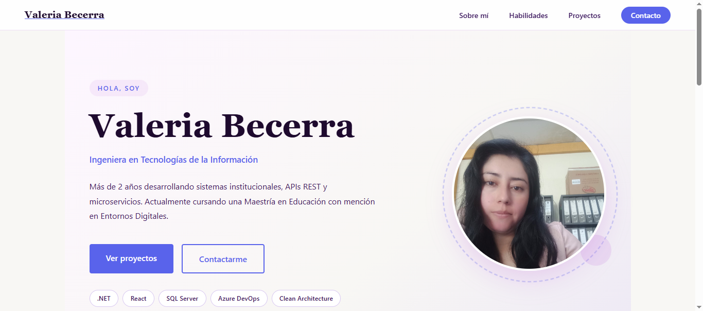

# Portafolio de Valeria Becerra 💻

Hola, soy **Valeria Becerra**, Ingeniera en Tecnologías de la Información.  
Actualmente soy desarrolladora junior, con ganas de aprender y crecer profesionalmente en desarrollo web y software.  

Tengo conocimientos en:

- **.NET** (C#)  
- **React** y **Vite**  
- **TailwindCSS**  
- **JavaScript / TypeScript básico**  
- **Git y GitHub**  
- Bases de datos básicas (SQL)  
- Desarrollo de aplicaciones web y manejo de **LocalStorage**  

---

## 🏆 Proyectos

### 1. [Tareonauta](https://tareonauta.vercel.app/)
**Descripción:** Aplicación web para gestionar tareas, permite agregar, editar, marcar como completadas y filtrar tareas.  
**Tecnologías:** React, TailwindCSS, Vite, LocalStorage  
**Repositorio:** [GitHub](https://github.com/valebcrr/tareonauta)

---
### 2. [Valeria Becerra | Web Developer](https://valeria-becerra.netlify.app/)

**Descripción:** Sitio web personal desarrollado con HTML y CSS puro para presentar mis proyectos y habilidades.  
**Tecnologías:** HTML5, CSS3  
**Repositorio:** [GitHub](https://github.com/valebcrr/valeria)

---
